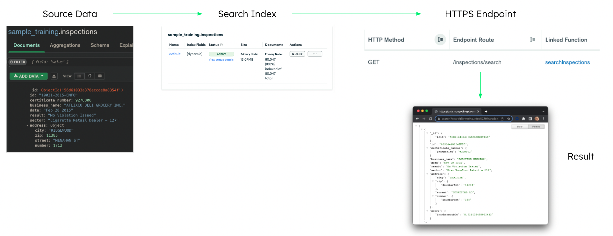

# Creating a Search Microservice
## Overview

This simple tutorial shows how to expose Atlas Search functionality via an Atlas HTTPS Endpoint.

For this tutorial I'll leverage the [sample_training.inspections](https://www.mongodb.com/docs/atlas/sample-data/sample-training/#sample_training.inspections) sample dataset.


## Step 1: Create the Search Index

[Create](https://www.mongodb.com/docs/atlas/atlas-search/create-index/) a default Search index on the sample_training.inspections collection.

## Step 2: Create the HTTPS Endpoint

Note, the HTTPS Endpoint requires a backing function, which when created from the HTTPS Endpoint, provides example code on how to access the endpoint's arguments and payload.

Set the Route to  /inspections/search


Set the HTTP Method to GET and Response With Result to ON.


Create a New Function and set the Function Name to **searchInspections**: 


Replace the provided sample function code with the following:

```JavaScript

// This function is the endpoint's request handler.
exports = function({ query, headers, body}, response) {
  
    // A default value for testing from this console if searchTerm is not defined.
    var searchTerm = "Fail"

    if (query != undefined)
      if (query.searchTerm != undefined)
        searchTerm = query.searchTerm;

    console.log("searchTerm: ", searchTerm);

    var inspectinsCollection = context.services.get("mongodb-atlas").db("sample_training").collection("inspections");

    const pipeline = [{$search: {
       index: 'default',
       text: {
        query: searchTerm,
        path: {
         wildcard: '*'
        }
       }
      }}, {$addFields: {
       score: {
        $meta: 'searchScore'
       }
      }}, {
        $limit: 10
      }]

    return inspectinsCollection.aggregate(pipeline).toArray()
      .then(inspections => {
        console.log(`Successfully searched inspections for ${searchTerm}.`)

        for(const inspection of inspections) {
          console.log(`business_name: ${inspection.business_name}`)
        }
        return inspections
      })
      .catch(err => console.error(`Failed to search inspections: ${err}`))

};


## Step 3: Update the searchInspections Function's Authentication

Edit the searchInspections function and set its Authentication to **System**


And since the function will never be called externally, go ahead and set Private to **ON**.


## Step 4: Test

Copy the callback URL from the HTTPS Endpoints settings:


Paste the URL in your browser, appending ?searchTerm=&lt;term>. For example:

https://data.mongodb-api.com/app/inspectionsearchservice-lxafd/endpoint/inspections/search?searchTerm=Thunder%20Mountain
